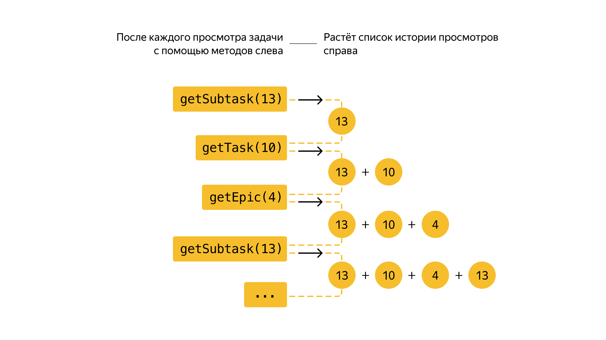

# Kanban desk

Трекер задач позволяет эффективно организовать совместную работу над задачами.

В настоящий момент ревлизована следующая функциолальность:

Типы задач:
Простейший кирпичик трекера — задача (англ. task).
Также есть Epic включающий в себя Subtask, созданный с целью декомпозиции большой задачи на более мелкие.
У Task,Epic и Subtask обладают следующими свойствами:

    Название, кратко описывающее суть задачи (например, «Переезд»).
    Описание, в котором раскрываются детали.
    Уникальный идентификационный номер задачи, по которому её можно будет найти.
    Статус, отображающий её прогресс. Вы будете выделять следующие этапы жизни задачи:
     1. NEW — задача только создана, но к её выполнению ещё не приступили.
     2. IN_PROGRESS — над задачей ведётся работа.
     3. DONE — задача выполнена.

     В трекере у каждого типа задач есть идентификатор.
     Это целое число, уникальное для всех типов задач. 
     По нему находят, обновляют, удаляют задачи. 
     При создании задачи менеджер присваивает ей новый идентификатор.

     Также реализовано тестирование программы с помощью библиотеки JUnit 5.
  
     Реализована история просмотров задач после вызовов методов менеджера.
     Пример формирования:

